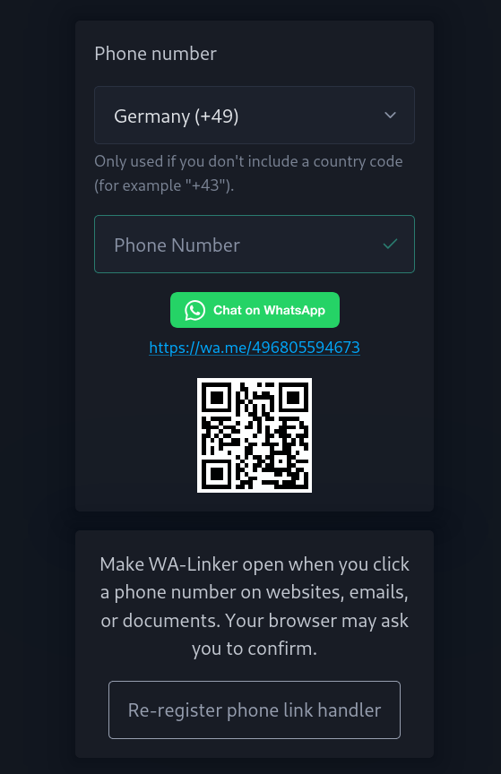

# WA-Linker

[WA-Linker](https://wa-linker.pages.dev) is a simple tool that lets you instantly open a WhatsApp chat with any phone number (provided they use WhatsApp) without having to save the number in your contacts first.

## Features

- Enter any phone number and instantly get a WhatsApp chat link
- Optionally specify a country code if the phone number does not already contain it
- QR code generation for sharing the link with other devices
- Works offline as an installable PWA
- Register as your system's `tel:` link handler (see below)

## tel: Protocol Handler

WA-Linker can register itself as your system's handler for `tel:` links. Once registered, clicking any phone number link (e.g. on a website or in an email) will open WA-Linker with the number pre-filled, ready to chat on WhatsApp.

There are two ways to register:

### 1. Install as PWA

When you install WA-Linker as a Progressive Web App in Chromium based browsers, the browser will automatically register it as a `tel:` protocol handler via the web app manifest.

### 2. Manual registration (Supported browsers)

Click the **"Register as tel: handler"** button in the app. The browser will prompt you to confirm. This uses the [`navigator.registerProtocolHandler()`](https://developer.mozilla.org/en-US/docs/Web/API/Navigator/registerProtocolHandler) API and works in both Chrome and Firefox.

## Development

### Development server

Run `ng serve` for a dev server. Navigate to `http://localhost:4200/`.

### Build

Run `ng build` to build the project. The build artifacts will be stored in the `dist/` directory.
